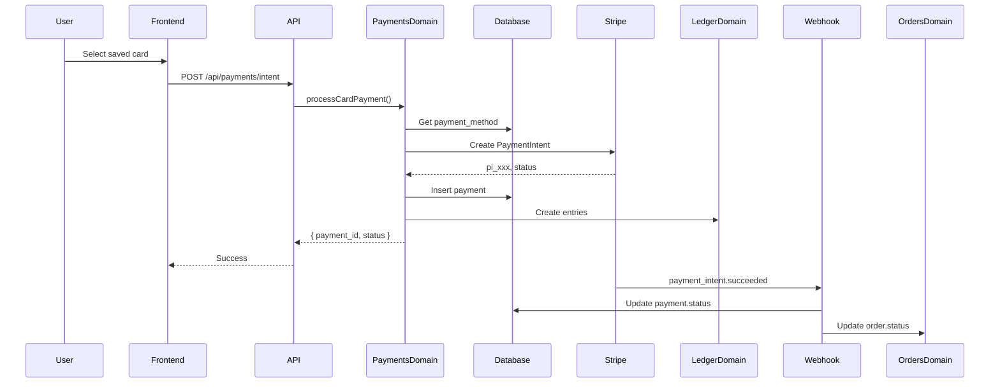

# Payments Domain

**Owner**: Backend Team  
**Last Updated**: May 4, 2026  
**Status**: Production Ready  
**Supported Rails**: Card (Stripe), Apple Pay, Cash App Pay

---

## 🎯 DOMAIN PURPOSE

The Payments domain handles all payment processing for GlenKeos Empire across:
- **Card payments** (Visa, Mastercard, Amex, Discover)
- **Apple Pay** (one-off and saved)
- **Cash App Pay** (one-off and saved)

**Critical**: This domain NEVER stores raw card data. All payment processing uses tokenization.

---

## 📊 DATA MODEL

### Database Tables

#### `payment_methods`
Stores tokenized payment methods (NEVER raw PAN).

```sql
CREATE TABLE payment_methods (
  id UUID PRIMARY KEY DEFAULT gen_random_uuid(),
  user_id UUID NOT NULL REFERENCES auth.users(id),
  type TEXT NOT NULL CHECK (type IN ('card', 'apple_pay', 'cash_app')),
  provider_reference TEXT NOT NULL,  -- Token from Stripe (pm_xxx)
  brand TEXT,                        -- visa, mastercard, amex, discover
  last4 TEXT,                        -- Last 4 digits (cards only)
  exp_month INTEGER,                 -- Expiration month (cards only)
  exp_year INTEGER,                  -- Expiration year (cards only)
  is_default BOOLEAN DEFAULT false,
  status TEXT NOT NULL DEFAULT 'active',
  created_at TIMESTAMPTZ NOT NULL DEFAULT NOW(),
  updated_at TIMESTAMPTZ NOT NULL DEFAULT NOW()
);
```

**Security Notes**:
- `provider_reference` is an opaque token (e.g., `pm_1234567890`)
- NEVER contains raw PAN
- NEVER contains CVV
- Frontend NEVER sees `provider_reference`

---

#### `payments`
Tracks payment transactions.

```sql
CREATE TABLE payments (
  id UUID PRIMARY KEY DEFAULT gen_random_uuid(),
  order_id UUID,
  user_id UUID NOT NULL REFERENCES auth.users(id),
  payment_method_id UUID REFERENCES payment_methods(id),
  amount INTEGER NOT NULL,               -- In cents (2599 = $25.99)
  currency TEXT NOT NULL DEFAULT 'USD',
  status TEXT NOT NULL,                  -- pending, authorized, captured, failed, refunded, chargeback
  provider TEXT NOT NULL,                -- stripe
  provider_reference TEXT,               -- Charge/PaymentIntent ID (ch_xxx, pi_xxx)
  provider_raw JSONB,                    -- Full Stripe response (debugging only)
  created_at TIMESTAMPTZ NOT NULL DEFAULT NOW(),
  updated_at TIMESTAMPTZ NOT NULL DEFAULT NOW()
);
```

**Why INTEGER amounts?**
- Avoids floating point precision errors
- Standard for payment processing ($25.99 = 2599 cents)
- Works for all currencies (USD cents, GBP pence, EUR cents, JPY yen)

---

#### `refunds`
Tracks refund transactions.

```sql
CREATE TABLE refunds (
  id UUID PRIMARY KEY DEFAULT gen_random_uuid(),
  payment_id UUID NOT NULL REFERENCES payments(id),
  amount INTEGER NOT NULL,               -- In cents
  currency TEXT NOT NULL DEFAULT 'USD',
  status TEXT NOT NULL,                  -- pending, succeeded, failed
  provider_reference TEXT,               -- Refund ID from Stripe
  provider_raw JSONB,
  created_at TIMESTAMPTZ NOT NULL DEFAULT NOW(),
  updated_at TIMESTAMPTZ NOT NULL DEFAULT NOW()
);
```

---

#### `ledger_entries`
Immutable double-entry accounting ledger.

```sql
CREATE TABLE ledger_entries (
  id UUID PRIMARY KEY DEFAULT gen_random_uuid(),
  payment_id UUID REFERENCES payments(id),
  order_id UUID,
  user_id UUID REFERENCES auth.users(id),
  debit_account TEXT NOT NULL,           -- customer_wallet, processor_settlement, fees, revenue
  credit_account TEXT NOT NULL,
  amount INTEGER NOT NULL,               -- In cents
  currency TEXT NOT NULL DEFAULT 'USD',
  metadata JSONB DEFAULT '{}',
  created_at TIMESTAMPTZ NOT NULL DEFAULT NOW()
);

-- Immutability triggers
CREATE TRIGGER prevent_ledger_update BEFORE UPDATE ON ledger_entries ...
CREATE TRIGGER prevent_ledger_delete BEFORE DELETE ON ledger_entries ...
```

---

## 🔄 PAYMENT FLOWS

### Flow 1: Card Payment (Saved Card)

```
1. Frontend: User selects saved card from payment_methods list
2. Frontend → API: POST /api/payments/intent
   {
     "order_id": "uuid",
     "amount": 2599,
     "currency": "USD",
     "payment_method_id": "uuid"
   }

3. Backend:
   a. Lookup payment_method → get provider_reference (pm_xxx)
   b. Call lib/payments/card.ts → processCardPayment()
   c. Stripe API: Create PaymentIntent with pm_xxx
   d. Database: Insert into payments table
   e. Database: Create ledger entries (if captured)
   f. Return: { payment_id, status }

4. Webhook:
   a. Stripe → POST /api/webhooks/stripe
   b. Verify signature
   c. Update payments.status
   d. Create ledger entries
   e. Update orders.status
```

#### Sequence Diagram



---

### Flow 2: Apple Pay Payment

```
1. Frontend: User taps Apple Pay button
2. Apple Pay JS: Shows Face ID / Touch ID
3. Apple Pay → Frontend: Returns payment token
4. Frontend → API: POST /api/payments/apple-pay
   {
     "order_id": "uuid",
     "amount": 2599,
     "currency": "USD",
     "apple_pay_token": { "token": "..." }
   }

5. Backend:
   a. Call lib/payments/apple-pay.ts → processApplePayPayment()
   b. Stripe API: Create charge with Apple Pay token
   c. Database: Insert into payments (payment_method_id = NULL for one-off)
   d. Database: Create ledger entries
   e. Return: { payment_id, status }
```

**Note**: Apple Pay tokens are one-off. We don't save them to `payment_methods` unless user explicitly opts in.

---

### Flow 3: Cash App Pay Payment

Similar to Apple Pay, but uses Cash App SDK for token generation.

---

### Flow 4: Refund

```
1. Manager Portal: Manager initiates refund
2. Frontend → API: POST /api/payments/refund
   {
     "payment_id": "uuid",
     "amount": 2599  // Optional, defaults to full amount
   }

3. Backend:
   a. Call lib/payments/refund.ts → processRefund()
   b. Database: Insert into refunds (status = pending)
   c. Stripe API: Create refund
   d. Database: Update refunds.status = succeeded
   e. Database: Create reverse ledger entries
   f. Database: Update payments.status = refunded
   g. Database: Update orders.status = refunded
   h. Return: { refund_id, status }
```

---

## 📁 DOMAIN STRUCTURE

```
src/lib/payments/
├── index.ts            # Main orchestrator (exports all)
├── card.ts             # Card payment processing
├── apple-pay.ts        # Apple Pay processing
├── cash-app.ts         # Cash App processing
├── refund.ts           # Refund processing
├── stripe-client.ts    # Stripe SDK wrapper
├── types.ts            # TypeScript types
└── utils.ts            # Shared utilities
```

---

## 🔧 API CONTRACTS

### Add Card

**Endpoint**: `POST /api/payment-methods/card`

**Request**:
```typescript
{
  payment_method_token: string  // From Stripe.js (pm_xxx)
}
```

**Response**:
```typescript
{
  id: string;
  type: 'card';
  brand: string;        // visa, mastercard
  last4: string;        // 4242
  exp_month: number;    // 12
  exp_year: number;     // 2030
  is_default: boolean;
}
```

**Implementation** (`src/lib/payments/card.ts`):
```typescript
export async function addCard(
  userId: string,
  token: string
): Promise<PaymentMethod> {
  // 1. Verify token with Stripe
  const pm = await stripe.paymentMethods.retrieve(token);
  
  // 2. Attach to customer
  await stripe.paymentMethods.attach(token, { customer: stripeCustomerId });
  
  // 3. Save to database
  const { data } = await supabase.rpc('add_payment_method_card', {
    p_user_id: userId,
    p_provider_reference: token,
    p_brand: pm.card.brand,
    p_last4: pm.card.last4,
    p_exp_month: pm.card.exp_month,
    p_exp_year: pm.card.exp_year,
  });
  
  return data;
}
```

---

### Create Payment Intent

**Endpoint**: `POST /api/payments/intent`

**Request**:
```typescript
{
  order_id: string;
  amount: number;           // In cents
  currency: string;         // USD, GBP, EUR, etc.
  payment_method_id: string; // UUID from payment_methods table
}
```

**Response**:
```typescript
{
  payment_id: string;
  status: 'pending' | 'captured' | 'failed';
}
```

**Implementation** (`src/lib/payments/card.ts`):
```typescript
export async function processCardPayment(
  params: CardPaymentParams
): Promise<Payment> {
  // 1. Get payment method
  const pm = await getPaymentMethod(params.payment_method_id);
  
  // 2. Create payment record (pending)
  const { data: payment } = await supabase.rpc('create_payment_intent', {
    p_user_id: params.userId,
    p_order_id: params.orderId,
    p_amount: params.amount,
    p_currency: params.currency,
    p_payment_method_id: params.payment_method_id,
  });
  
  // 3. Create Stripe PaymentIntent
  const intent = await stripe.paymentIntents.create({
    amount: params.amount,
    currency: params.currency,
    payment_method: pm.provider_reference,
    confirm: true,
  });
  
  // 4. Update payment with Stripe reference
  await supabase.from('payments').update({
    provider_reference: intent.id,
    status: intent.status === 'succeeded' ? 'captured' : 'pending',
  }).eq('id', payment.id);
  
  // 5. Create ledger entries if captured
  if (intent.status === 'succeeded') {
    await createLedgerEntries(payment.id, params.amount);
  }
  
  return payment;
}
```

---

### Process Apple Pay

**Endpoint**: `POST /api/payments/apple-pay`

**Request**:
```typescript
{
  order_id: string;
  amount: number;
  currency: string;
  apple_pay_token: { token: string };
}
```

**Response**:
```typescript
{
  payment_id: string;
  status: 'captured' | 'failed';
}
```

---

### Process Cash App Pay

**Endpoint**: `POST /api/payments/cash-app`

**Request**:
```typescript
{
  order_id: string;
  amount: number;
  currency: string;
  cash_app_token: string;
}
```

**Response**:
```typescript
{
  payment_id: string;
  status: 'captured' | 'failed';
}
```

---

## 🔐 SECURITY REQUIREMENTS

### ✅ MUST DO

1. **Never store raw PAN**
   - Always tokenize on frontend (Stripe.js)
   - Backend only receives `pm_xxx` tokens

2. **Never store CVV**
   - Not even encrypted
   - PCI DSS violation

3. **Always verify webhook signatures**
   ```typescript
   const signature = request.headers.get('stripe-signature');
   const event = stripe.webhooks.constructEvent(
     body,
     signature,
     WEBHOOK_SECRET
   );
   ```

4. **Always use INTEGER amounts**
   - No DECIMAL, no FLOAT
   - Prevents precision errors

5. **Always create ledger entries**
   - Every captured payment = ledger entry
   - Every refund = reverse ledger entry

### ❌ NEVER DO

1. ❌ Log `provider_reference` or `provider_raw` in production
2. ❌ Send `provider_reference` to frontend
3. ❌ Store amounts as floats
4. ❌ Skip webhook signature verification
5. ❌ Process payments without updating ledger

---

## 🧪 TESTING

### Local Testing (Stripe Test Mode)

```typescript
// Test card numbers
const TEST_CARDS = {
  success: '4242424242424242',
  decline: '4000000000000002',
  insufficient_funds: '4000000000009995',
};

// Test in development
const payment = await processCardPayment({
  userId: 'test-user',
  orderId: 'test-order',
  amount: 1000,  // $10.00
  currency: 'USD',
  payment_method_id: 'test-pm-id',
});

expect(payment.status).toBe('captured');
expect(payment.amount).toBe(1000);
```

### Webhook Testing

```bash
# Install Stripe CLI
brew install stripe/stripe-cli/stripe

# Forward webhooks to local
stripe listen --forward-to localhost:3000/api/webhooks/stripe

# Trigger test event
stripe trigger payment_intent.succeeded
```

---

## 📈 MONITORING

### Key Metrics

| Metric | Alert Threshold |
|--------|----------------|
| Payment success rate | < 95% |
| Avg payment latency | > 2s |
| Refund rate | > 5% |
| Chargeback rate | > 1% |
| Webhook processing time | > 500ms |

### Logging

```typescript
// ✅ DO log these
logger.info('Payment processed', {
  payment_id: payment.id,
  order_id: payment.order_id,
  amount: payment.amount,
  status: payment.status,
});

// ❌ DON'T log these
logger.info('Payment', {
  provider_reference: payment.provider_reference,  // ❌ Secret
  provider_raw: payment.provider_raw,              // ❌ Contains PII
});
```

---

## 🔄 EXTENSION POINTS

### Adding a New Payment Rail (e.g., Venmo)

1. **Update database**:
   ```sql
   ALTER TYPE payment_type ADD VALUE 'venmo';
   ```

2. **Create domain file** `src/lib/payments/venmo.ts`:
   ```typescript
   export async function processVenmoPayment(params: VenmoParams) {
     // Implementation
   }
   ```

3. **Update orchestrator** `src/lib/payments/index.ts`:
   ```typescript
   export async function processPayment(params: PaymentParams) {
     switch (params.type) {
       case 'venmo': return processVenmoPayment(params);
       // ...
     }
   }
   ```

4. **Update this doc** - Add Venmo flow + contracts

---

## 📚 RELATED DOMAINS

- **Orders**: Payments update order status
- **Ledger**: Payments create ledger entries
- **Notifications**: Payments trigger payment notifications
- **Support**: Refunds may be initiated from support tickets

---

## ✅ CHECKLIST: Making Changes to Payments Domain

- [ ] Update database migration if schema changes
- [ ] Update `src/lib/payments/*` domain logic
- [ ] Update API routes in `src/app/api/payments/*`
- [ ] Update this documentation (PAYMENTS_DOMAIN.md)
- [ ] Add/update tests
- [ ] Test with Stripe test cards
- [ ] Test webhook handling with Stripe CLI
- [ ] Update monitoring dashboards
- [ ] Deploy migration + code together

---

## 🚀 QUICK START (New Engineer)

1. **Read this doc** (you're doing it!)
2. **Run local migrations**:
   ```bash
   supabase db reset
   ```
3. **Set up Stripe**:
   ```bash
   # .env.local
   VITE_STRIPE_PUBLISHABLE_KEY=pk_test_...
   STRIPE_SECRET_KEY=sk_test_...
   STRIPE_WEBHOOK_SECRET=whsec_...
   ```
4. **Test payment flow**:
   ```typescript
   // Use test card
   const token = 'pm_card_visa';
   const payment = await addCard(userId, token);
   ```
5. **Read the code**:
   - Start: `src/lib/payments/index.ts`
   - Then: `src/lib/payments/card.ts`
   - Then: `src/app/api/payments/intent/route.ts`

---

**This domain is the template for all future domains. Clone and adapt.**
